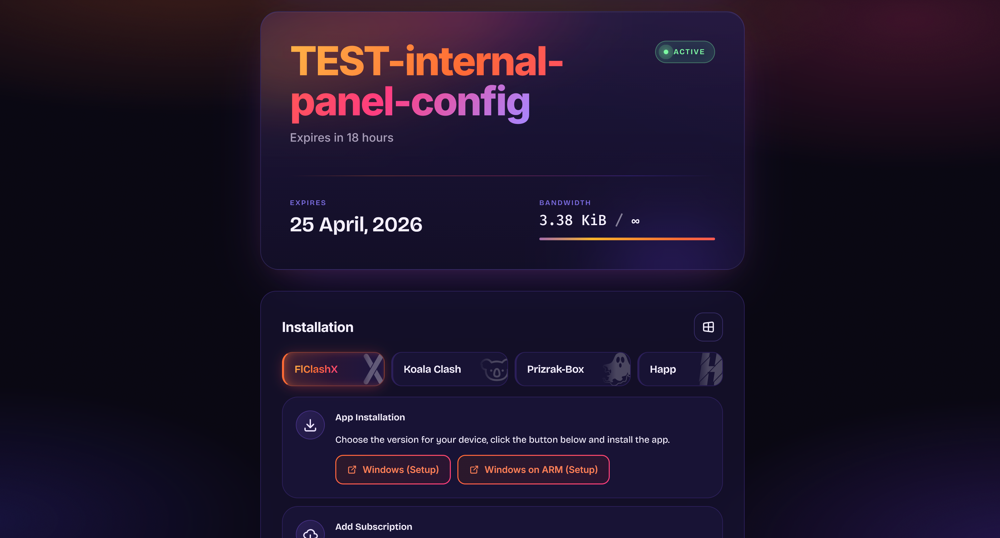

## Remnawave Subscription Page — Maelstrom fork

Learn more about Remnawave [here](https://remna.st/).

## Fork changes

Frontend has been redesigned end-to-end. Backend is untouched from upstream.

### Design system
- New palette: deep indigo-violet base with sunset accent gradients (orange → pink → violet) and sage mint / warm rust for status colours. Replaces the original cyan/dark theme ([`theme.ts`](frontend/src/shared/constants/theme/theme.ts)).
- Typography: **Inter** for body and display, **Fira Mono** for values / UUIDs. Fonts loaded from Google Fonts.
- Global aurora background with animated gradient blobs + subtle film grain ([`global.css`](frontend/src/global.css)).
- Cards share a 24px-rounded glass surface (`rgba(26, 20, 56, 0.55)` + `backdrop-filter`) with a violet hairline border.

### Layout
- Legacy top header bar removed. Replaced with a new **Header card** ([`header-card/`](frontend/src/widgets/main/header-card/)) that holds the logo, service name, language picker, Get-link button, and support link — all as icon-only pills.
- **User / subscription card** rewritten ([`subscription-info-expanded.widget.tsx`](frontend/src/widgets/main/subscription-info/subscription-info-expanded.widget.tsx)): huge gradient username, mint "ACTIVE" pill with a pulsing dot, sunset divider, asymmetric stats grid (expiry + bandwidth with an animated gradient fill bar for unlimited).
- **Installation card** title now matches the rest, OS selector converted from native `<select>` to a Mantine `<Menu>` icon-picker. Featured-badge yellow dot removed from app tabs. Setup / Add-subscription buttons restyled as outlined sunset-gradient buttons.
- Language picker moved out of the page footer into the header card; restyled to match the other action icons.

### Connection keys overhaul
- New protocol parser ([`shared/utils/parse-connection-link/`](frontend/src/shared/utils/parse-connection-link/)) supports Shadowsocks, VLESS, VMess, Trojan, Hysteria 2, TUIC, SOCKS/HTTP. Extracts host, port, credentials, and all transport-specific fields.
- Each config renders as a compact row: name + IP on the left, coloured protocol pill on the right.
- Clicking a row opens a detail modal with a blurred backdrop, per-field copy buttons, a tinted QR code (custom tiled SVG using the sunset gradient — see [`shared/ui/qr-tiles`](frontend/src/shared/ui/qr-tiles/)), and a full-link copy button.

### Other
- Copy buttons share one visual language: outlined sunset-gradient border, soft hover glow, label swaps to "Link copied" for ~5s on click.
- Custom logo (`frontend/public/assets/logo.png`) used both as the favicon and as the header-card brand mark.
- Several hardcoded cyan/teal/blue occurrences in widgets were routed through the new palette so no stray bright blue/cyan remains.

## Contributors

Check [open issues](https://github.com/remnawave/subscription-page/issues) to help the progress of this project.

Thanks to the all contributors who have helped improve Remnawave:

